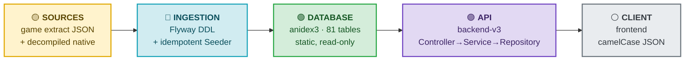
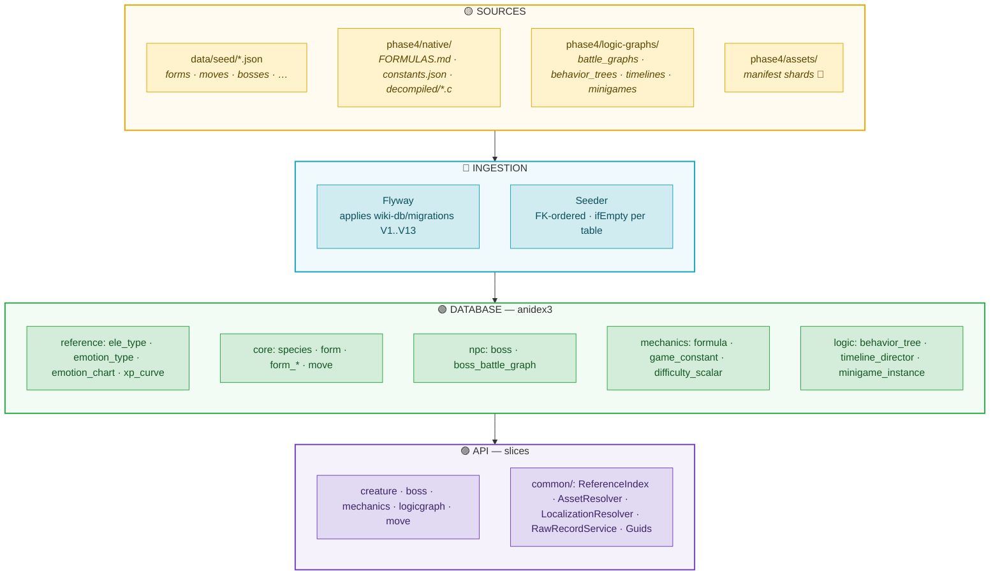
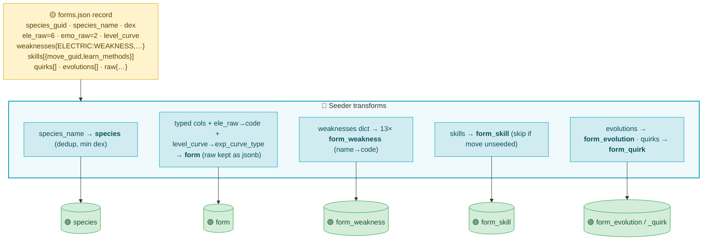
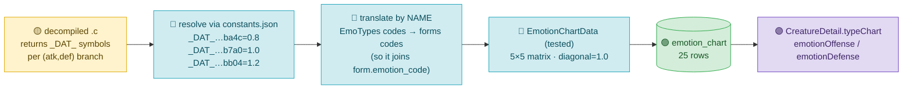
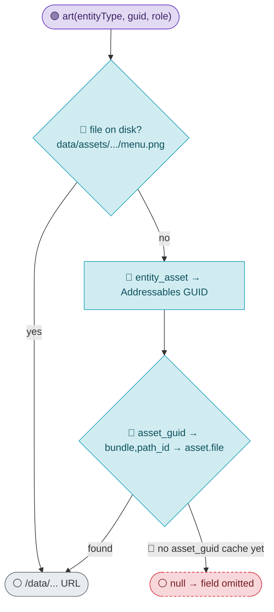
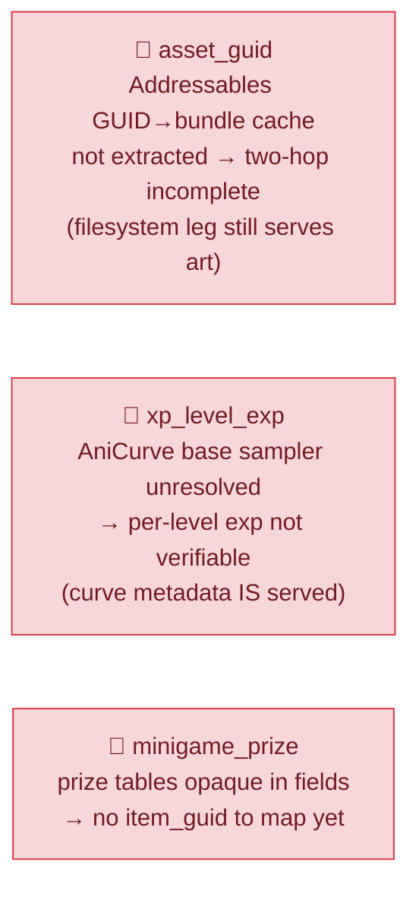

# backend-v3 — visual architecture

A layered tour: first the **big picture** (five boxes), then we open each box to
show the **real data** and **how it's transformed** at every hop. Diagrams are
Mermaid (render on GitHub / most Markdown viewers).

🎨 **Colour key** — 🟡 sources · 🔵 transform · 🟢 database · 🟣 API/DTO ·
⚪ client · 🔴 honest gap (blocked on data extraction)

---

## 0. The big picture

Five stages. Data flows left→right at runtime; the seed pipeline (stages 1–3)
runs once at boot.



---

## 1. Open the boxes — what's inside each stage



---

## 2. DRILL — how a creature row becomes JSON (the read path)

Follow one real creature (**Mewaii**) from raw columns to the response. The
redesign stores compact **int codes** + **no art columns**; the repository
*resolves* them, the service *assembles*, the serializer *omits nulls*.

```mermaid
flowchart LR
    subgraph DBR["🟢 DB ROW (form)"]
        direction TB
        r["guid 8f6bea97…<br/>ele_type_code = <b>6</b><br/>emotion_code = <b>2</b><br/>(no art column)<br/>stat_hp/atk/… ints"]
    end

    subgraph REPO["🔵 REPOSITORY — resolve"]
        direction TB
        x1["ReferenceIndex.ele(6) → <b>VIRUS</b>"]
        x2["ReferenceIndex.emotion(2) → <b>MESTUS</b>"]
        x3["AssetResolver.art(form,guid,menu_art)<br/>→ /data/forms/…/menu.png"]
        x4["form_weakness + emotion_chart<br/>→ TypeChartService (pure)"]
    end

    subgraph DTO["🟣 DTO (CreatureDetail)"]
        direction TB
        d["ele: VIRUS · emo: MESTUS<br/>menuArt: /data/…<br/>typeChart{ elemental, emotion± }<br/>statGrades · regions · evoChain"]
    end

    subgraph JSON["⚪ JSON RESPONSE"]
        direction TB
        j["camelCase keys<br/>null fields <b>omitted</b><br/>Cache-Control: 1h"]
    end

    DBR -->|"RowMapper"| REPO -->|"Service assembles"| DTO -->|"Jackson non_null"| JSON

    classDef dbc fill:#D4EDDA,stroke:#28A745,color:#155724;
    classDef xf  fill:#D1ECF1,stroke:#17A2B8,color:#0b4f5c;
    classDef api fill:#E2D9F3,stroke:#6F42C1,color:#3d2566;
    classDef cli fill:#E9ECEF,stroke:#6C757D,color:#343a40;
    class r dbc; class x1,x2,x3,x4 xf; class d api; class j cli;
    style DBR fill:#F2FBF4,stroke:#28A745; style REPO fill:#F0FAFC,stroke:#17A2B8;
    style DTO fill:#F6F2FC,stroke:#6F42C1; style JSON fill:#F1F3F5,stroke:#6C757D;
```

---

## 3. DRILL — how raw JSON becomes typed rows (the seed path)

One `forms.json` record **fans out** into the species + form + child tables. The
Seeder transforms each field to its typed home; codes 0/blank become NULL FKs;
dangling refs are skipped (logged), never crash the seed.



---

## 4. DRILL — recovering the emotion chart from the binary

The trickiest transform: a decompiled C function → resolved constants → an
enum-system translation → seeded rows the creature page joins. This is why the
emotion axis is *correct*, not guessed.



---

## 5. DRILL — hybrid asset resolution (one contract, two legs)

Every art field returns a `/data/...` URL — filesystem first, DB manifest as
fallback.



---

## 6. Slice catalogue — input tables → output, with status

Each slice is the same Controller→Service→Repository seam over different tables.

```mermaid
flowchart LR
    subgraph IMPL["✅ Implemented (whole backend)"]
        direction TB
        m1["<b>creature·move·item·card·furniture</b><br/>dex/2-axis · learners · recipe/drops · pools · catalogue"]
        m2["<b>boss·trainer·camp·squadron</b><br/>battle-graph · party/where-found · targets/tasks · members"]
        m3["<b>map·quest·story</b><br/>spawns/shops/battles + map-graph · state-machine · scenes/cities"]
        m4["<b>mechanics·logicgraph·type·loc·meta·achievement·tutorial</b><br/>formulas/curves · BT/timeline/minigame · analytics/quirks · 8-lang · counts"]
    end

    subgraph PLAN["⏸ Deferred (blocked on data)"]
        direction TB
        p1["<b>asset</b> 🔴 resolver endpoint<br/>Addressables GUID→bundle cache not extracted"]
    end

    IMPL ~~~ PLAN

    classDef done fill:#D4EDDA,stroke:#28A745,color:#155724;
    classDef todo fill:#F8D7DA,stroke:#DC3545,color:#721c24,stroke-dasharray:4 3;
    class m1,m2,m3,m4 done; class p1 todo;
    style IMPL fill:#F2FBF4,stroke:#28A745,stroke-width:2px;
    style PLAN fill:#FDF2F3,stroke:#DC3545,stroke-width:2px;
```



---

## 7. Honest gaps (🔴 blocked on data extraction, not skipped)



> These are genuine extraction limits, documented and isolated — the rest of each
> slice works, and they light up the moment the missing source lands.
