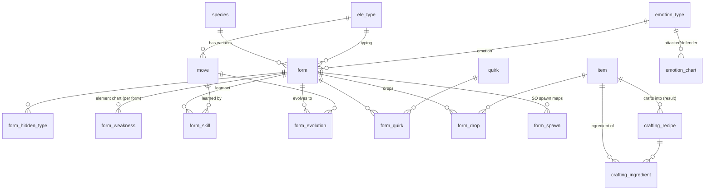
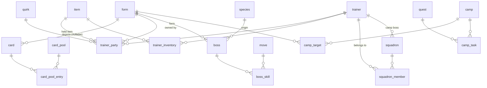
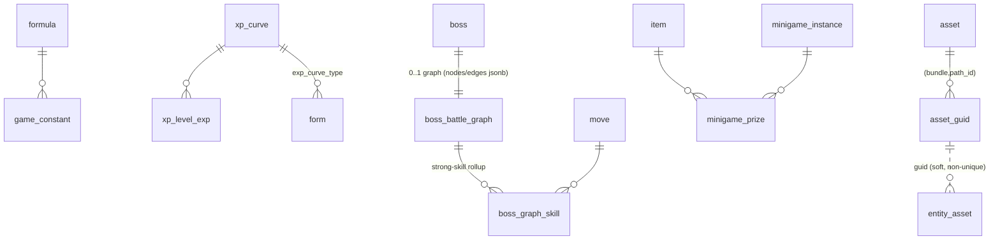

# LumenTale Wiki — Database Redesign

A **from-scratch** Postgres schema for the *LumenTale: Memories of Trey* wiki,
rebuilt to absorb the full `phase4-complete` extract. It supersedes the old
`anidex2` schema (`lumentale-wiki/backend/.../db/migration/V1–V9`) and is
designed so **everything connects to everything** — every cross-reference in the
game data becomes a foreign key or an explicit edge table.

- **81 tables** across 13 modules · **50 cross-module FKs** + 4 integrity CHECKs + named soft links.
- Migrations: [`migrations/V1__reference.sql`](migrations/) … `V13__foreign_keys.sql`.
- **v2 (revised)** after design review — see [§7 Revisions](#7-revisions-applied-v2).
- Source data: `engine/data/`, `engine/phase2-extract/raw/`, and the four new
  `phase4-complete/` layers (`native/`, `logic-graphs/`, `assets/`, charts).

> The four NEW phase4 layers — **type/emotion charts** (Module 1+2), **formulas,
> constants & XP curves** (Module 9), **logic graphs** (Module 10), and the **full
> asset manifest** (Module 11) — are the parts the old schema never modelled.

---

## 1. Design conventions (read once)

| Convention | Rule |
|---|---|
| **Primary key** | The game-entity **GUID** is the PK for every entity table, typed as native **`uuid`** (the dashed UUIDs). Unity **asset** GUIDs (32-hex, not UUIDs) stay `text`. Graph nodes use their Unity **`path_id`** (signed int64 → `bigint`). Link tables use `bigserial`. |
| **Variant-keyed creatures** | `form` (the battle variant) is the creature PK; `species` is the parent identity it FKs to. A "Pokédex page" = a species + its forms. |
| **Typed vs raw** | Queryable/joinable fields get real typed columns; the full extracted record is preserved in a `raw jsonb` column (the long tail) on each entity table. |
| **Enums** | Two combat axes get dedicated tables (`ele_type`, `emotion_type`). Each other game enum domain gets **its own small lookup table** (`skill_category`, `quest_type`, `item_material`, …) with a real per-column FK — no generic OTLT table. Engine/Unity/Wwise enums are excluded. |
| **Relationships** | M:N and 1:N are explicit child/link tables (`form_skill`, `trainer_party`, `card_pool_entry`, …). |
| **Graphs (hybrid)** | Whole-graph layers the wiki renders one-at-a-time (story scenes, behavior trees, timelines, boss battle graphs) are stored as **jsonb documents** (`nodes`/`edges`/`tracks`) for one-row page reads, **plus small rollup tables** for the cross-cutting joins (`story_scene_battle`, `boss_graph_skill`, …). |
| **Polymorphic refs** | Eliminated. Where a ref could target several tables (shop entries, quest rewards, map/scene battles) the schema uses **one typed nullable FK column per target + a `CHECK`** that exactly one is set — real referential integrity, no `ref_type` discriminator. |
| **Two GUID namespaces** | Game-entity GUIDs = dashed UUID (`a4b8-…`). Unity **asset** GUIDs = 32-char lowercase hex, no dashes — stored in the `*_guid` art columns and resolved through `asset_guid` (Module 11). They never collide; keep them distinct. |
| **Localization** | Source text is **Italian** (`name_raw` columns). Any `*_key` column is a localization key joining `localization(table_name, string_id)` across 8 langs. |
| **Read-only** | The dataset is static post-seed; the backend treats every row as immutable and cacheable. |

---

## 2. Module map

| # | Module | File | Tables |
|---|---|---|---|
| 1 | Reference & charts | `V1__reference.sql` | `ele_type`, `emotion_type`, 9 per-domain enum lookups (`skill_category`, `skill_target_type`, `skill_aoe_type`, `item_material`, `item_target_type`, `item_battle_target`, `quest_type`, `achievement_rarity`, `achievement_visibility`), `emotion_chart`, `difficulty_scalar`, `quirk` |
| 2 | Creatures | `V2__creatures.sql` | `species`, `form`, `form_hidden_type`, `form_weakness`, `form_skill`, `form_evolution`, `form_quirk`, `form_spawn`, `form_drop` |
| 3 | Battle reference | `V3__battle_reference.sql` | `move`, `item`, `crafting_recipe`, `crafting_ingredient` |
| 4 | Cards | `V4__cards.sql` | `card`, `card_pool`, `card_pool_entry` |
| 5 | World | `V5__world.sql` | `game_map`, `map_sibling`, `mini_map`, `map_graph_edge`, `map_exit`, `map_pickup`, `map_spawner`, `map_spawn`, `map_shop`, `map_shop_entry`, `map_battle`, `map_battle_form` |
| 6 | Quests & story | `V6__quests_story.sql` | `quest`, `quest_item_reward`, `quest_node`, `quest_transition`, `variable`, `story_scene` (nodes/edges jsonb), `story_scene_flag`, `story_scene_battle`, `story_scene_trigger`, `tutorial`, `tutorial_page` |
| 7 | NPCs & groups | `V7__npcs_groups.sql` | `trainer`, `trainer_party`, `trainer_inventory`, `boss`, `boss_skill`, `camp`, `camp_target`, `camp_task`, `squadron`, `squadron_member` |
| 8 | Catalogue | `V8__catalogue.sql` | `achievement`, `furniture`, `product` |
| 9 | **Mechanics (NEW)** | `V9__mechanics.sql` | `formula`, `game_constant`, `xp_curve`, `xp_level_exp` |
| 10 | **Logic graphs (NEW)** | `V10__logic_graphs.sql` | `boss_battle_graph` (nodes/edges jsonb), `boss_graph_skill`, `behavior_tree` (nodes/edges jsonb), `timeline_director` (tracks jsonb), `minigame_instance`, `minigame_prize` |
| 11 | **Assets (NEW)** | `V11__assets.sql` | `asset`, `asset_guid`, `entity_asset` |
| 12 | Localization | `V12__localization.sql` | `localization`, `loc_key` |
| 13 | Cross-module FKs | `V13__foreign_keys.sql` | (constraints only) |

---

## 3. The connection map (ER)

`form` is the hub: nearly every gameplay table points back to a form. The
diagrams below are grouped by module for readability; cross-module edges are
listed under each and enforced in `V13`.

### 3.1 Creatures & battle reference (the core)



- `form_weakness` is the **elemental** effectiveness axis (per defending form ×
  attacking `ele_type`). `emotion_chart` is the **emotion** axis (global 5×5).
  Together they are the two multipliers in the damage pipeline (Module 9).

### 3.2 Cards · NPCs · groups



### 3.3 World · quests · story

```mermaid
erDiagram
    game_map ||--o{ game_map          : "parent"
    game_map ||--o{ map_sibling       : ""
    game_map ||--o{ map_graph_edge    : "reachability from/to"
    game_map ||--o{ map_exit          : "doors source/target"
    game_map ||--o{ map_pickup        : ""
    game_map ||--o{ map_spawner       : ""
    map_spawner ||--o{ map_spawn      : ""
    form     ||--o{ map_spawn         : "wild encounter"
    item     ||--o{ map_pickup        : ""
    game_map ||--o{ map_shop          : ""
    map_shop ||--o{ map_shop_entry    : "polymorphic ref"
    game_map ||--o{ map_battle        : ""
    map_battle ||--o{ map_battle_form : ""
    form     ||--o{ map_battle_form   : ""
    quest    ||--o{ quest_node        : ""
    quest    ||--o{ quest_item_reward : "item/furniture (typed+CHECK)"
    quest_node ||--o{ quest_transition: "edges"
    story_scene ||--o{ story_scene_flag : "rollup"
    story_scene ||--o{ story_scene_battle : "trainer/boss (typed+CHECK)"
    story_scene ||--o{ story_scene_trigger : "fires on map+npc"
    game_map ||--o{ story_scene_trigger : ""
    variable ||..o{ story_scene_flag  : "name (soft)"
    variable ||..o{ quest_node        : "condition refs (soft)"
    tutorial ||--o{ tutorial_page     : ""
    %% story_scene also holds nodes/edges as jsonb documents (whole-graph render)
```



### 3.4 NEW layers — mechanics · logic graphs · assets



**Asset resolution (two hops):**
`form.menu_art` (32-hex Addressables GUID) → `asset_guid.guid` → `(bundle, path_id)`
→ `asset` → `asset.file`. The same path resolves `item.icon_guid`, `card.art_guid`,
`furniture.model_guid`, `trainer.sprite_anim_guid`, `tutorial_page.asset_guid`, etc.
`entity_asset` is a generic catch-all so any entity can enumerate **all** its assets,
not just the few typed art columns.

---

## 4. Source → table mapping

| Source file | → Table(s) |
|---|---|
| `data/lumen_species.json` | `species` |
| `data/forms.json` | `form`, `form_hidden_type`, `form_weakness`, `form_skill`, `form_evolution`, `form_quirk`, `form_spawn`, `form_drop` |
| `readable/evolutions.json` | `form_evolution` (human-readable conditions) |
| `data/moves.json` | `move` |
| `data/items.json` (+ `recipe`/`used_in`/`drops`) | `item`, `crafting_recipe`, `crafting_ingredient`, `form_drop` |
| `data/cards.json`, `data/card_pools.json` | `card`, `card_pool`, `card_pool_entry` |
| `data/maps_full.json`, `data/maps_mini.json` | `game_map`, `map_sibling`, `mini_map` |
| `raw/map_graph.json` | `map_graph_edge` |
| `raw/map_placements.json` | `map_exit`, `map_pickup` |
| `raw/map_spawns.json` | `map_spawner`, `map_spawn` |
| `raw/map_shops.json` | `map_shop`, `map_shop_entry` |
| `raw/map_npcs.json` | `map_battle`, `map_battle_form` |
| `raw/quests.json` | `quest`, `quest_item_reward`, `quest_node`, `quest_transition` |
| `raw/story_scenes.json` | `story_scene` (nodes/edges jsonb), `story_scene_flag`, `story_scene_battle` |
| `raw/story_links.json` | `story_scene_trigger` |
| `raw/variables.json` | `variable` |
| `raw/tutorials.json` | `tutorial`, `tutorial_page` |
| `data/trainers.json` | `trainer`, `trainer_party`, `trainer_inventory` |
| `data/bosses.json` | `boss`, `boss_skill` |
| `data/camps.json` | `camp`, `camp_target`, `camp_task` |
| `data/squadrons.json` | `squadron`, `squadron_member` |
| `data/achievements.json` | `achievement` |
| `data/furniture.json` | `furniture` |
| `data/products.json` | `product` |
| `data/_enums.json` (game domains) | `enum_value`, `ele_type`, `emotion_type` |
| `engine/build_quirks.py` output | `quirk` |
| **`native/FORMULAS.md`** | `formula`, `difficulty_scalar` |
| **`native/constants.json`** | `game_constant` (named subset) |
| **AniCurve / `AniCurve__GetExpForLevel.c`** | `xp_curve`, `xp_level_exp` |
| **`logic-graphs/battle_graphs.json`** | `boss_battle_graph` (nodes/edges jsonb) + `boss_graph_skill` rollup |
| **`logic-graphs/behavior_trees.json`** | `behavior_tree` (nodes/edges jsonb) |
| **`logic-graphs/timelines.json`** (+`_crossbundle_resolved`) | `timeline_director` (tracks jsonb) |
| **`logic-graphs/minigames.json`** | `minigame_instance`, `minigame_prize` |
| **`assets/manifest.jsonl`** | `asset` |
| **`.guid_to_bundle.cache`** | `asset_guid` |
| (resolved per entity) | `entity_asset` |
| `raw/loc/`, `loc_en.json`, `_enums.json` loc tables | `localization`, `loc_key` |

---

## 5. Type charts — how the two axes are modelled

The game has **two** independent effectiveness axes, and they are stored
differently in the binary, so the schema mirrors that:

1. **Elemental** (14 `ele_type`s). Stored as **per-form** `Weaknesses[13]` arrays —
   there is no single global SO. Modelled as `form_weakness(form_guid, attacker_code,
   effectiveness)`. A canonical element×element chart is **derivable** as a view if
   all forms of a given defending type share identical columns:

   ```sql
   CREATE VIEW ele_chart AS
   SELECT f.ele_type_code AS defender_code, w.attacker_code,
          mode() WITHIN GROUP (ORDER BY w.effectiveness) AS effectiveness
   FROM form f JOIN form_weakness w ON w.form_guid = f.guid
   GROUP BY f.ele_type_code, w.attacker_code;
   ```
   (Verify uniformity before trusting it as global; otherwise keep it per-form.)

2. **Emotion** (5 `emotion_type`s). A true global 5×5 chart recovered from native
   code → `emotion_chart(attacker_code, defender_code, multiplier)`, values
   ×1.2 / ×0.8 / ×1.0. Seed from
   `native/decompiled/BattleMath__GetEmotionalTypeEffectivenessMultiplier.c`.

The full damage path that consumes both lives in `formula` (key `damage`) with the
constants in `game_constant` and the difficulty step in `difficulty_scalar`.

---

## 6. Notes, gaps & decisions

- **From-scratch, not a patch.** This replaces `anidex2` V1–V9. The numbering
  restarts at `V1`; point Flyway at this `migrations/` dir on a fresh database
  (`anidex3`), or rename to follow-on `V10+` if you prefer to migrate in place.
- **Seeding is out of scope** (per the chosen deliverable). Each table's source
  is mapped in §4; the existing `lumentale-wiki/backend/.../seed/Seeder.java`
  and `engine/phase2-extract/extract_*.py` are the templates. Declare `V13` FKs
  as `NOT VALID` then `VALIDATE CONSTRAINT` if you seed after applying DDL.
- **jsonb is deliberate** for: sparse graph-node payloads (`battle_node.payload`,
  `bt_node.params`, `story_node.payload`, `minigame_instance.fields`), AI weight
  blobs (`trainer.ai`, `boss.ai`), AnimationCurve keyframes, and every `raw`
  column. Promote a field to a typed column only when the wiki needs to
  filter/sort/join on it.
- **Honest residual limits** (carried from the extract, unchanged by this schema):
  damage/stat formulas are *structurally* complete but not numerically verified;
  catch rate is an event-driven modifier chain, not a closed form (kept as a
  `formula` row, not a constant); 27 timeline directors are cross-bundle (still
  captured, `crossbundle = true`); 14 bosses have no scripted graph
  (`boss_battle_graph.note` records why); audio (Wwise) is out of scope.
- **What stayed jsonb vs the old schema:** the old schema kept `hidden_types`
  and `weaknesses` as jsonb on `form`; this redesign promotes both to
  `form_hidden_type` and `form_weakness` so the type pages can be built with
  pure joins. Quirks gained a real `quirk` catalogue table. Conversely, the
  graph layers (story/behavior/timeline/battle) are kept as jsonb documents +
  rollups rather than fully normalized — see §7.

---

## 7. Revisions applied (v2)

After a design review, four professional improvements were applied over the
first cut. They trade nothing the wiki needs and strengthen integrity:

1. **Per-domain enum lookups, not an OTLT.** The generic `enum_value(domain,
   code, name)` table was a recognized anti-pattern (a single FK can't constrain
   a column to one domain). Replaced by one small lookup table per domain
   (`skill_category`, `quest_type`, `item_material`, …), each a real,
   domain-scoped FK target. (Native PG `ENUM` types were the alternative; lookup
   tables won because they carry localizable labels.)
2. **Typed FK columns + CHECK instead of polymorphic `ref_guid`/`ref_type`.**
   On `map_shop_entry`, `quest_item_reward`, `map_battle`, `story_scene_battle`
   the target set is small and fixed, so each gets one nullable FK column per
   target type + a `num_nonnulls(...) = 1` CHECK. The DB now enforces the union;
   no runtime `ref_type` resolution. (4 CHECK constraints, 8 new typed FKs.)
3. **Hybrid graph storage.** The first cut over-normalized story scenes into
   `story_node`/`story_edge` (and likewise behavior/timeline). But the wiki
   renders a *whole* graph per page — a single jsonb row read beats a
   join+aggregate. Reverted to **jsonb whole-graph documents** (`nodes`/`edges`/
   `tracks`) **plus** the small cross-cut rollups (`story_scene_battle/_flag/
   _trigger`, `boss_graph_skill`) that genuinely need joins. The recursive
   timeline track tree is also far cleaner as jsonb than as a self-referencing
   table.
4. **`uuid` PK type for entity GUIDs.** Entity PKs/FKs moved from `text` to
   native `uuid` (validation + narrower indexes). Unity asset GUIDs (32-hex,
   not valid UUIDs) stay `text` and resolve through `asset_guid`.

Net: **81 tables, 50 cross-module FKs, 4 CHECKs.** Statically validated — every
FK resolves to a PK/UNIQUE target and every FK column type matches its target.
```
